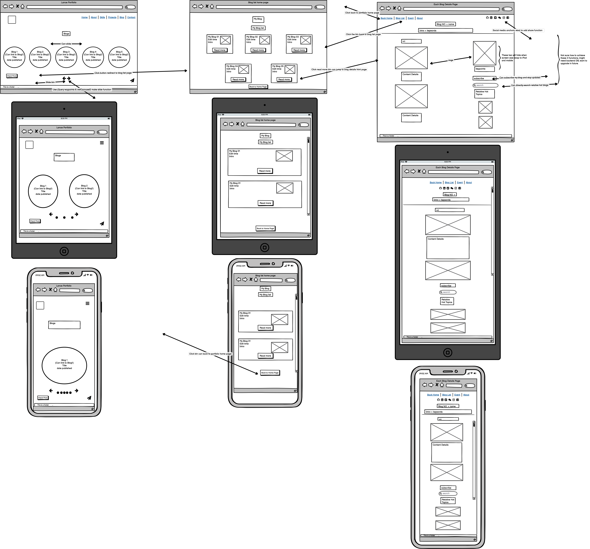
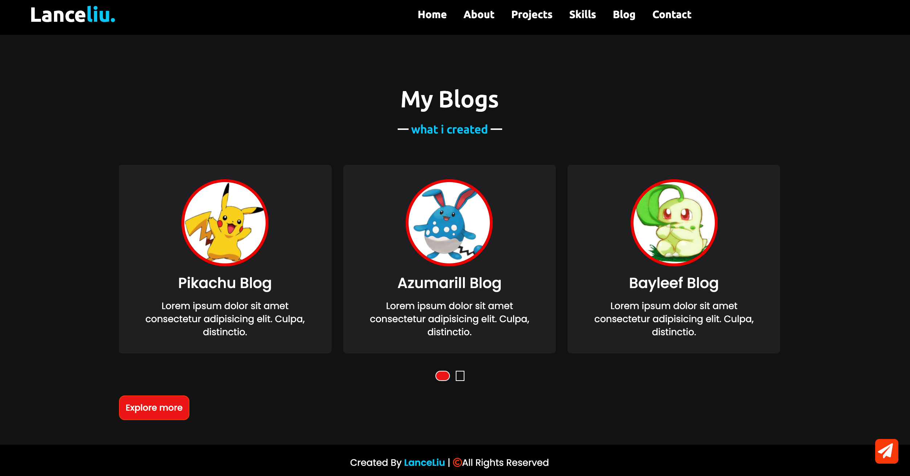

# LanceLiu_Portfolio

***

## A link (URL) to my published portfolio website
[LanceLiu_Portfolio](https://lanceliu-portfolio.netlify.app/)

## A link to my GitHub repo
[LanceLiu_Github](https://github.com/lanceliumeng/LanceLiu_Portfolio)
***

## Description of my portfolio website, including,

### Purpose
**This portfolio website will help me to find a web developer job. :grin:**  
*In addition,I will keep updating my portfolio and make sure it relates with my new skills*
### Functionality / features
**My portfolio website has the below features**
* CSS flexbox control;
* Font Awesome 5 icons;
* My LOGO;
* JS DOM function;
* jQuery typing animation script;
* cdnjs waypoints and owlCarousel2 combanition to create beautiful responsive carousel slider, in my case, blog list;
***

## Sitemap

## <i class="fa fa-gear fa-spin fa-2x" style="color: firebrick"></i> Workframe (TLDR):wink:
1. ***Home Page Workframe*** :octocat:

2. ***About Me Page Workframe*** :octocat:

3. ***Project list Page Workframe*** :octocat:

4. ***Skills Page Workframe*** :octocat:

5. ***Blog List Page Workframe*** :octocat:

6. ***Contact Page Workframe*** :octocat:

## Screenshots :tada::tada::tada:
1. ***Home Page*** :video_game:

2. ***About Me Page*** :video_game:

3. ***Project List Page*** :video_game:

4. ***Skill Page*** :video_game:

5. ***Blog List Page*** :video_game:

6. ***Contact Page*** :video_game:

## Target audience
**Potential employer, Peers developer or anyone interests about my portfolio. :heart_eyes:**

## Tech stack (e.g. html, css, deployment platform, etc)
* HTML5 :heart:
* CSS :yellow_heart:
* JavaScript :sparkling_heart: :star:
* jQuery :thumbsup:
* cdnjs :thumbsup:
* Balsamiq-Wireframes :cat:
* Draw.io :honeybee:
* Netlify-Deployment-Platform :heartpulse:
* Canva :sparkles:
* Postman :cupid:

