# LanceLiu_Portfolio

***

## A link (URL) to my published portfolio website
[LanceLiu_Portfolio](https://lanceliu-portfolio.netlify.app/)

## A link to my GitHub repo
[LanceLiu_Github](https://github.com/lanceliumeng/LanceLiu_Portfolio)
***

## Description of my portfolio website, including,

### Purpose
**This portfolio website will help me to find a web developer job.**  
*In addition,I will keep updating my portfolio and make sure it relates with my new skills*
### Functionality / features
**My portfolio website has the below features**
* CSS flexbox control;
* Font Awesome 5 icons;
* My LOGO;
* JS DOM function;
* jQuery typing animation script;
* cdnjs waypoints and owlCarousel2 combanition to create beautiful responsive carousel slider, in my case, blog list;
***

## Sitemap
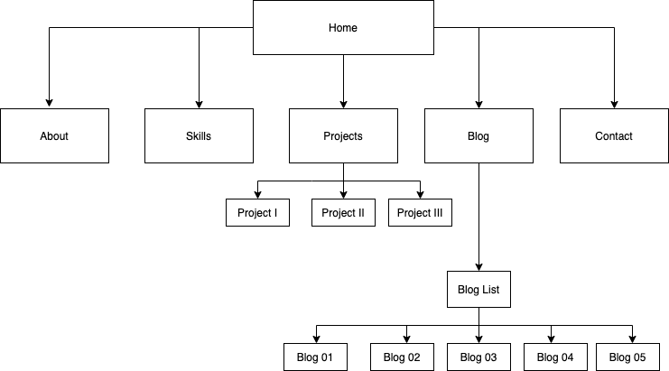

## Workfram
* 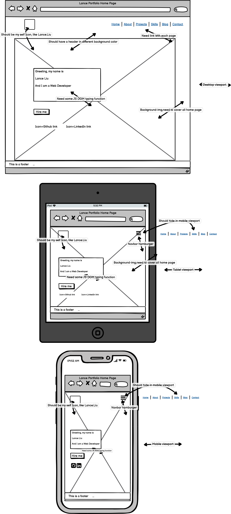
* 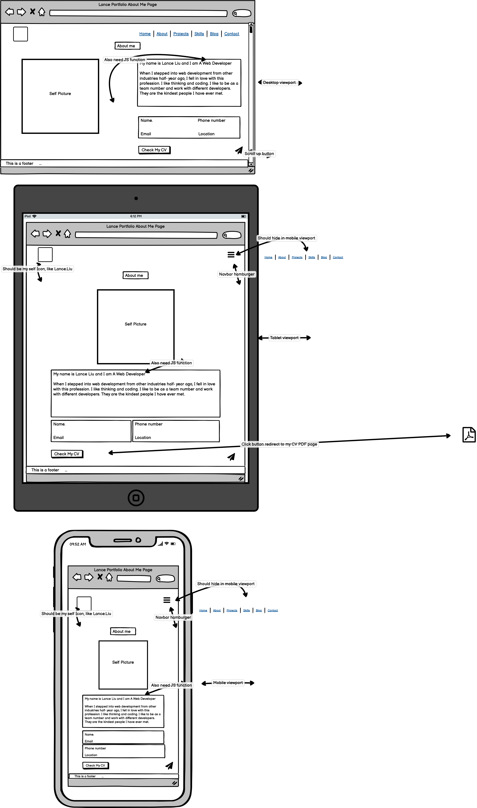
* 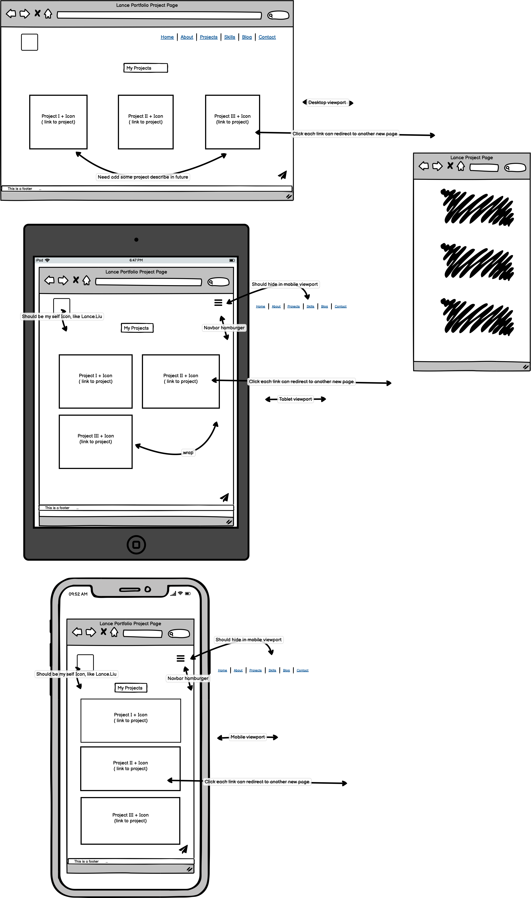
* 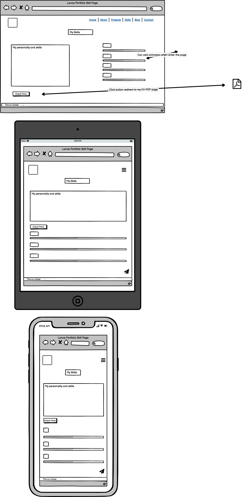
* 
* 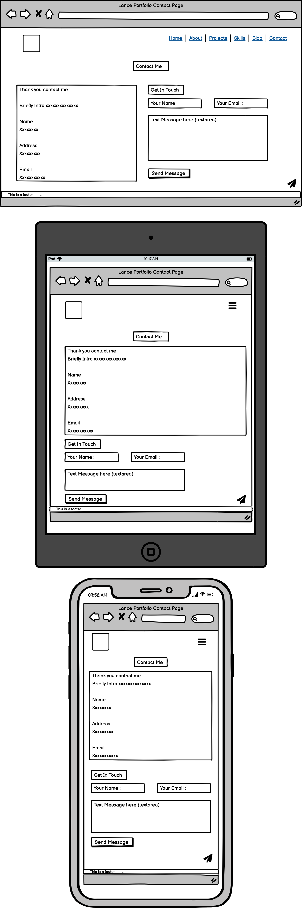

## Screenshots
* 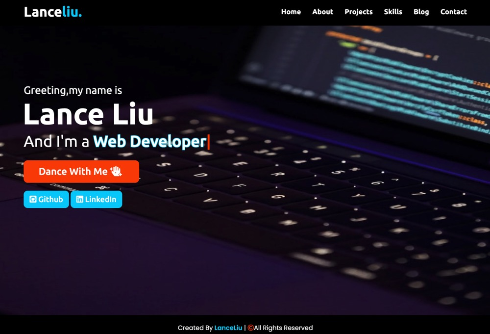
* 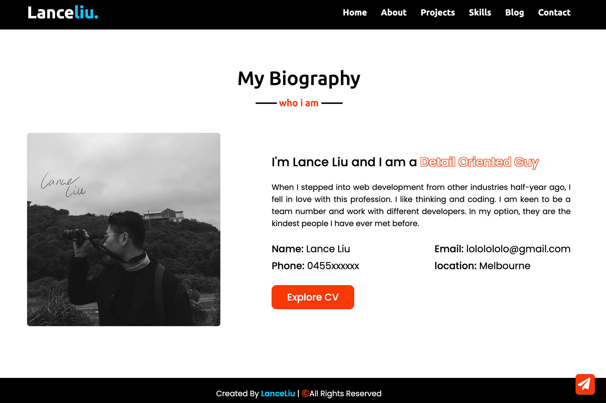
* 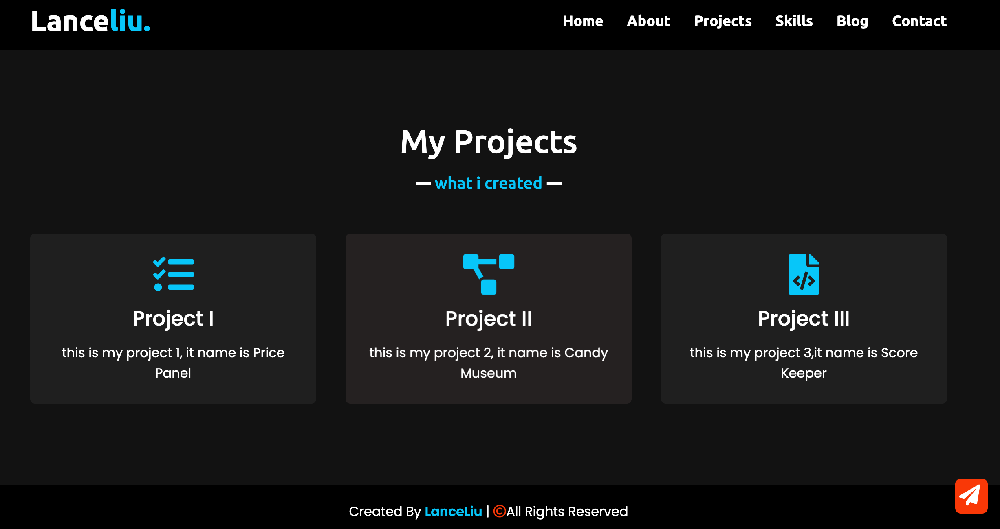
* 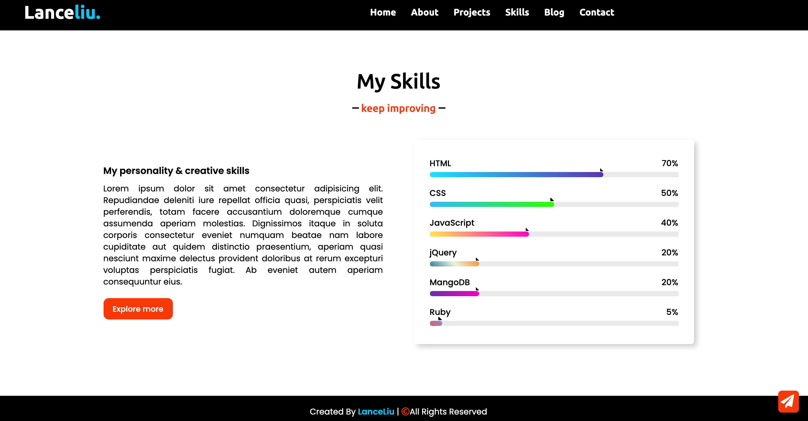
* 
* 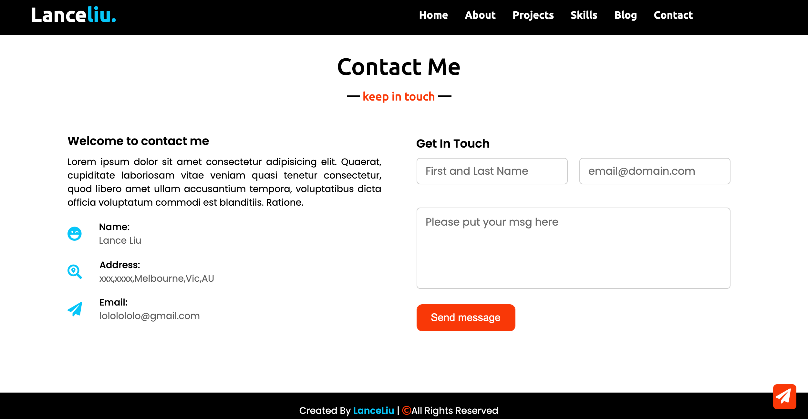
* 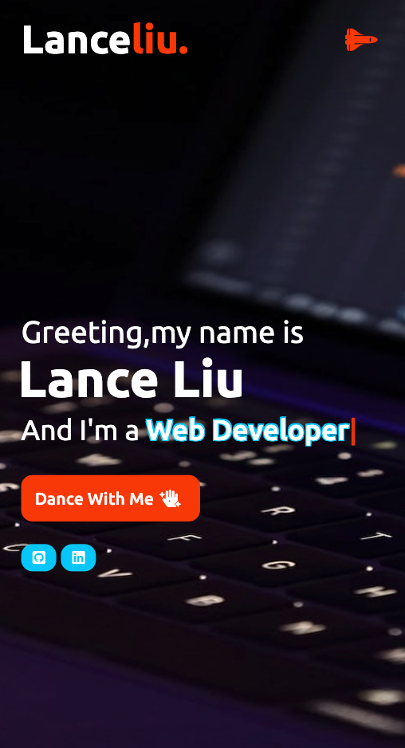
* 

## Target audience
**Potential employer, Peers developer or anyone interests about my portfolio**

## Tech stack (e.g. html, css, deployment platform, etc)
* HTML5
* CSS
* JavaScript
* jQuery 
* cdnjs
* Balsamiq-Wireframes
* Draw.io
* Netlify-Deployment-Platform
* Canva
* Postman

